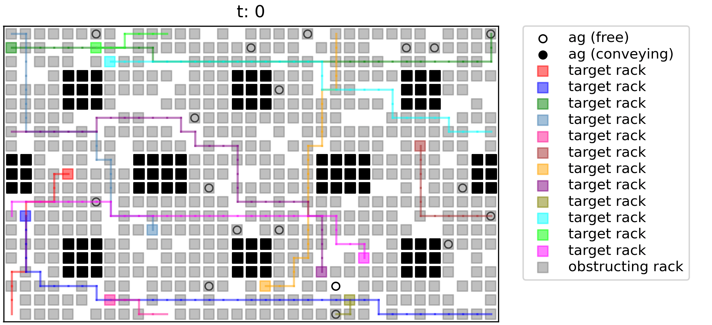

# MAPF-HD: Multi-Agent Path Finding in High-Density Environments

This repository provides the official implementation of MARPF-HD, a framework for multi-agent and multi-rack path finding in high-density grid environments.


<div align="center">

</div>

## Background
In environments with numerous automated guided vehicles, planning efficient, collision-free paths is critical. 
Multi-agent path finding (MAPF) addresses the challenge of planning simultaneous, collision-free paths for multiple agents. Its extension, multi-agent pickup and delivery (MAPD), integrates path-planning with task assignment, where agents transport rack-type objects from pickup to delivery locations.
In dense warehouse settings, a key challenge is moving only the racks scheduled for shipment while treating all others as movable obstacles.
We formalize this problem as multi-agent and multi-rack path finding (MARPF), which extends MAPF/MAPD by distinguishing between target and obstacle racks.
Although MARPF can be formulated using integer linear programming (ILP), this approach incurs an exponential computational cost.
To address this, we propose a novel multi-stage heuristic method.
First, it computes a trajectory for each target rack and plans the evacuation of any obstructing racks.
These rack trajectories are then decomposed into discrete tasks and assigned to agents. On grid benchmarks ranging from $7\times5$ to $35\times21$ with rack densities up to $90\%$, our method generates plans in under $10$ s while maintaining success rates above $90\%$. For instances where ILP solutions are tractable, our approach achieves makespans within $20$--$30\%$ of the optimal, whereas ILP fails to scale to larger problems. 
The proposed method has the potential to improve operational efficiency in various real-world applications, including warehouse logistics, traffic management, and crowd control.

## Preparation

1. Clone this repository

2. Run
```
conda env create -f environment.yml
conda activate marpf
```
- MP4 output requires ffmpeg to be available in the environment or on your system PATH.
- GIF output requires pillow.


## Example

We provide the four examples with different settings.
The animation shown above corresponds to `run_env3.py`.
```
python run_env1.py
python run_env2.py
python run_env3.py
python run_env4.py
```


## License
This repository is licensed under `LICENSE.md`.
